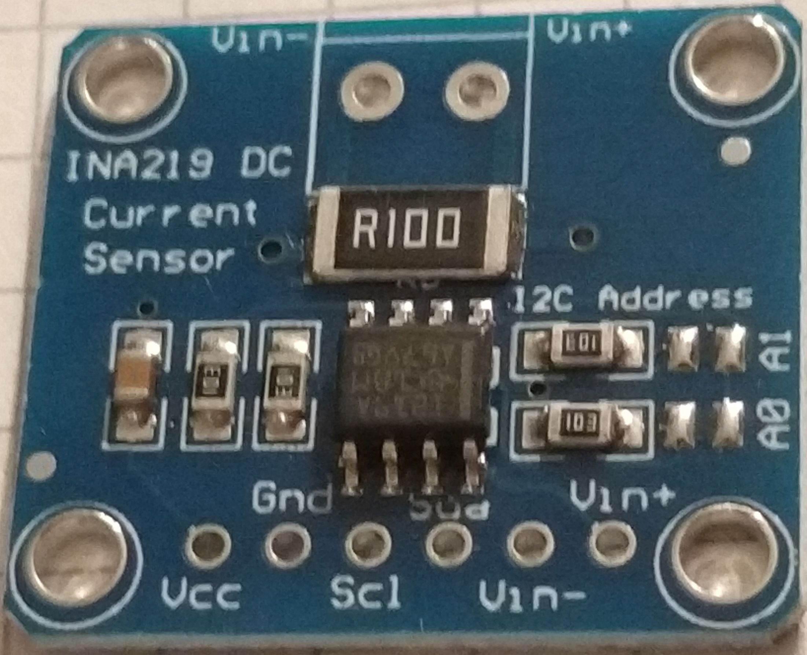

# INA219 and INA232
simple interface to INA219 voltage current and power monitor

##### Table of contents
- [introduction](#introduction)
- [INA219 class](#INA219-class)
- [INA219 interface](#INA219-interface)
    - [INA219                     ](#INA219                     )
    - [INA219 conversion_ready  ](#INA219-conversion_ready  )  
    - [INA219 clear_ready_flag  ](#INA219-clear_ready_flag  ) 
    - [INA219 overflow          ](#INA219-overflow          ) 
    - [INA219 getCurrent        ](#INA219-getCurrent        )
    - [INA219 getShuntVoltage   ](#INA219-getShuntVoltage   ) 
    - [INA219 getPower          ](#INA219-getPower          )
    - [INA219 setCalibration    ](#INA219-setCalibration    )
    - [INA219 getCalibration    ](#INA219-getCalibration    )
    - [INA219 reset             ](#INA219-reset             )
    - [INA219 setBusVoltageRange](#INA219-setBusVoltageRange)
    - [INA219 setAdcResolution  ](#INA219-setAdcResolution  )
    - [INA219 setAdcAveraging   ](#INA219-setAdcAveraging   )
    - [INA219 setShuntGain      ](#INA219-setShuntGain      )
    - [INA219 setOperationMode  ](#INA219-setOperationMode  )			

- [INA232 class](#INA232-class)
- [INA232 interface](#INA232-interface)
    - [INA232                                     ](#INA232                                     )
	- [isINA232                                   ](#isINA232                                   )
    - [INA232 conversion_ready                    ](#INA232-conversion_ready                    )  
    - [INA232 clear_ready_flag                    ](#INA232-clear_ready_flag                    ) 
    - [INA232 overflow                            ](#INA232-overflow                            ) 
    - [INA232 getCurrent                          ](#INA232-getCurrent                          )
    - [INA232 getShuntVoltage                     ](#INA232-getShuntVoltage                     ) 
    - [INA232 getPower                            ](#INA232-getPower                            )
    - [INA232 setCalibration                      ](#INA232-setCalibration                      )
    - [INA232 getCalibration                      ](#INA232-getCalibration                      )
	- [INA232 calcSuntGain                        ](#INA232-calcSuntGain                        )
    - [INA232 reset                               ](#INA232-reset                               )
    - [INA232 setAdcAveraging                     ](#INA232-setAdcAveraging                     )
	- [INA232 setAdcConversionTime                ](#INA232-setAdcConversionTime                )
    - [INA232 setShuntGain                        ](#INA232-setShuntGain                        )
    - [INA232 setOperationMode                    ](#INA232-setOperationMode                    )			
	- [INA232 setMaskFlag                         ](#INA232-setMaskFlag                         )                
	- [INA232 readMaskFlag                        ](#INA232-readMaskFlag                        )               
	- [INA232 getMaskFlag                         ](#INA232-getMaskFlag                         )                
	- [INA232 enableConversionReadyAlertProcessing](#INA232-enableConversionReadyAlertProcessing)
	- [INA232 isConversionReadyAlertProcessing    ](#INA232-isConversionReadyAlertProcessing    )


  
## introduction
The INA219 is a combined voltage, current and power monitoren chip by [Texas Instrument](https://www.ti.com).  
It is controlled via an I2C Interface and features a 12 bit ADC resulting a Resolution of ~10 µV for shunt voltage (current measurement) and 4 mV for voltage measurement.  
There are similar chips eg. the INA232 which is pin compatible but features a 16 bit ADC or the INA3221 which is a triple version with 13 bit ADC.  


There are ready to use circuit boards available:  
  


## INA219 class
The INA219 class offers a simple interface closely related to register and function naming in the datasheet.
It has been build around the Arduino Framework and makes use of the wire library.


### INA219 interface
```
INA219(uint8_t addr);

bool conversion_ready(uint16_t * pBusVoltage_mV);
void clear_ready_flag(void);
bool overflow(void);

int16_t getCurrent(void);
int16_t getShuntVoltage(void);
uint16_t getPower(void);

void setCalibration(uint16_t Cal);
uint16_t getCalibration(void);

void reset(void);
void setBusVoltageRange(bus_voltage_range_et range);
void setAdcResolution(	adc_selector_et adc,
						adc_res_et resolution);
void setAdcAveraging(	adc_selector_et adc,
						uint8_t scale);	// 0-7 = averaging 2^scale samples
void setShuntGain(		gain_et gain);
void setOperationMode(	op_mode_et mode);				
```

There are only a few functions needed to control the chip. The only value guaranteed to be a mV value is the bus voltage.  
The shunt voltage is read as internal value which is either 80.96 mV or 20.48 mV at full scale resulting in  ~2.47 uV or 625 uV resolution.
The accuracy and base of the current and power reading depends on the shunt resistor. 
The shunt resistor and the desired full scale reading leads to the calibration value which needs to be programmed to the INA232. See datasheet for details.
The power reading is the the product of the bus voltage register and the current register. See datasheet for details

#### INA219
constructor, needs to be called with the chip I2C adress

#### INA219 conversion_ready
returns true when a conversion cycle is completed.  
The busVoltage is valid and Current and power can be read.  

#### INA219 clear_ready_flag
is equal to getPower.  
The read flag is cleared whenever the power register is read or a new opration mode is set.  


#### INA219 overflow
returns overflow flag which is set on an math overflow calculating the power register  


#### INA219 getCurrent
gets the current reading calculatet from the shunt voltage and the calibration register

#### INA219 getShuntVoltage
reads the shunt voltage in 10 µV units

#### INA219 getPower
reads the power register based on the bus voltage and current value

#### INA219 setCalibration
sets the calibration register.  
the value has to be calculated according to the datasheet  

#### INA219 getCalibration
reads the calibration register

#### INA219 reset
performs a chip reset

#### INA219 setBusVoltageRange
the bus voltage range can be either 16 V or 32 V {	BUS_VOLTAGE_16V, BUS_VOLTAGE_32V }


#### INA219 setAdcResolution
the ADC resolution can be 9 - 12 bits
{ ADC_RES_9BIT, ADC_RES_10BIT, ADC_RES_11BIT, ADC_RES_12BIT	}

#### INA219 setAdcAveraging
the ADC averaging can be 0 to 7 resulting in no averaging (2^0) or 128 samples averaging (2^7)

#### INA219 setShuntGain
the shunt gain can be set to 1/1, 1/2, 1/4 or 1/8 reslting in 320 mV, 160 mV, 80 mV or 40 mV full scale  
{ PG_1,	PG_div_2, PG_div_4, PG_div_8 } 

#### INA219 setOperationMode				
ther are 8 different operation modes ranging form inactive over singele conversion to continuous conversion over both voltage and curren. See datatsheet for details.
{MODE_POWER_DOWN, MODE_CURRENT_SINGLE, MODE_VOLTAGE_SINGLE, MODE_ALL_SINGLE, MODE_ADC_OFF, MODE_CURRENT_CONTINUOUS, MODE_VOLTAGE_CONTINUOUS, MODE_ALL_CONTINOUS} 
 

## INA232 class
The INA232 class offers a simple interface closely related to register and function naming in the datasheet.
It has been build around the Arduino Framework and makes use of the wire library.


### INA232 interface
```
INA232(uint8_t addr, uint8_t alert_pin=-1);

bool isINA232(void);

bool conversion_ready(uint16_t * pBusVoltage_mV);
void clear_ready_flag(void);
bool overflow(void);

int16_t getCurrent(void);
int16_t getShuntVoltage(void);
uint16_t getPower(void);


void setCalibration(uint16_t Cal);
void setCalibration(uint16_t Rshunt_mR, uint16_t CurrentResolution_mA, uint16_t MaxCurrent_mA);
uint16_t getCalibration(void);
gain_et calcSuntGain(uint16_t Rshunt_mR, uint16_t MaxCurrent_mA);

void reset(void);
void setAdcAveraging(	uint8_t scale);	// 0-7 = 0-3 2^(2*scale) samples
										//		 4-7 2^(3+scale) samples
void setAdcConversionTime(adc_selector_et adc,
						uint8_t time);	// 0-7 ~2^(time+6)us
void setShuntGain(		gain_et gain);
void setOperationMode(	op_mode_et mode);				

void setMaskFlag(event_msk_et Flag, bool bEnable);
bool readMaskFlag(event_msk_et Flag);
bool getMaskFlag(event_msk_et Flag);

void enableConversionReadyAlertProcessing(bool bEnable);
bool isConversionReadyAlertProcessing(void);
```

There are only a few functions needed to control the chip. The only value guaranteed to be a mV value is the bus voltage.  
The shunt voltage is read as internal value which is a multiple of 10 µV.  
The accuracy and base of the current and power reading depends on the shunt resistor. 
The shunt resistor and the desired full scale reading leads to the calibration value 
which needs to be programmed to the INA219. See datasheet for details.
The power reading is the the product of the bus voltage register and the current register divided by 5000.

#### INA232
constructor, needs to be called with the chip I2C adress

#### isINA232
checks Device - ID to confirm IN232 chip

#### INA232 conversion_ready
returns true when a conversion cycle is completed.  
The busVoltage is valid and Current and power can be read.  

#### INA232 clear_ready_flag
is equal to getPower.  
The read flag is cleared whenever the power register is read or a new opration mode is set.  


#### INA232 overflow
returns overflow flag which is set on an math overflow calculating the power register  


#### INA232 getCurrent
gets the current reading calculatet from the shunt voltage and the calibration register

#### INA232 getShuntVoltage
reads the shunt voltage in 10 µV units

#### INA232 getPower
reads the power register based on the bus voltage and current value

#### INA232 setCalibration
sets the calibration register.  
the value has to be calculated according to the datasheet  
using the second version of this function the calibration value can be calculated passing the nessecary values:
 - shunt resistor in milli ohms
 - desired resolution in makes
 - max current in mA

#### INA232 getCalibration
reads the calibration register

#### INA232 calcSuntGain
calculates th shunt gain from shunt resistor value and desired max. current

#### INA232 reset
performs a chip reset

#### INA232 setAdcConversionTime
Parameters:
 - sected adc: CURRENT, VOLTAGE
 - time index: 0-7,  ~2^time+6^ us  
 
#### INA232 setAdcAveraging
the ADC averaging can be 0 to 7 resulting in no averaging (2^0^) or 128 samples averaging (2^7^)

#### INA232 setShuntGain
the shunt gain can be set to ADC_RANGE_0 or 1 reslulting in 20.48 mV or 80.96 mV full range

#### INA232 setOperationMode				
ther are 8 different operation modes ranging form inactive over singele conversion to continuous conversion over both voltage and curren. See datatsheet for details.
{MODE_POWER_DOWN, MODE_CURRENT_SINGLE, MODE_VOLTAGE_SINGLE, MODE_ALL_SINGLE, MODE_ADC_OFF, MODE_CURRENT_CONTINUOUS, MODE_VOLTAGE_CONTINUOUS, MODE_ALL_CONTINOUS} 
 
 
 
#### INA232 setMaskFlag    
Parameters
 - Flag  selection
    - CONVERSION_READY_ALERT_ENABLE  
	  enables assertion of alert pin by conversion ready
    - POWER_OVER_LIMIT_ALERT_ENABLE  
	  enables assertion of alert pin by power over limit
    - BUS_UNDER_LINIT_ALERT_ENABLE  
	  enables assertion of alert pin by bus under limit
    - BUS_OVER_LINIT_ALERT_ENABLE  
	  enables assertion of alert pin by bus over limit
    - SHUNT_UNDER_LINIT_ALERT_ENABLE  
	  enables assertion of alert pin by shunt under limit
    - SHUNT_OVER_LINIT_ALERT_ENABLE  
	  enables assertion of alert pin by shunt over limit
  - enable / disable

   {  	LATCH_ENABLE					= 0,	// R/W 0=Transparent / 1= Latched
								ALERT_POLARITY					= 1,	// R/W 0=active low	/ 1= acitve high
								OVERFLOW_FLAG					= 2,	// R match overflow current / power claculation
								CONVERSION_READY_FLAG			= 3,	// R conversipn ready, new data available
								ALERT_FUNCTION_FLAG				= 4,	// R 0=Alert has been asserted by conversion ready
																		//   1=Alert has been asserted by alert condition
								MEMORY_ERROR					= 5, 	// R internal CRC or ECC error has occured
								CONVERSION_READY_ALERT_ENABLE	=10,	// R/W enables assertion of alert pin by conversion ready
								POWER_OVER_LIMIT_ALERT_ENABLE	=11,	// R/W enables assertion of alert pin by power over limit
								BUS_UNDER_LINIT_ALERT_ENABLE	=12,	// R/W enables assertion of alert pin by bus under limit
								BUS_OVER_LINIT_ALERT_ENABLE		=13,	// R/W enables assertion of alert pin by bus over limit
								SHUNT_UNDER_LINIT_ALERT_ENABLE	=14,	// R/W enables assertion of alert pin by shunt under limit
								SHUNT_OVER_LINIT_ALERT_ENABLE	=15		// R/W enables assertion of alert pin by shunt over limit
							} event_msk_et;
							 
#### INA232 readMaskFlag                        
reads the content of the event register and returns the the desired flag
Paramter
 - Falg
   - ALERT_POLARITY					 
   - OVERFLOW_FLAG					 
   - CONVERSION_READY_FLAG			 
   - ALERT_FUNCTION_FLAG				 
   - MEMORY_ERROR					
   - CONVERSION_READY_ALERT_ENABLE	
   - POWER_OVER_LIMIT_ALERT_ENABLE	
   - BUS_UNDER_LINIT_ALERT_ENABLE	
   - BUS_OVER_LINIT_ALERT_ENABLE		
   - SHUNT_UNDER_LINIT_ALERT_ENABLE	
   - SHUNT_OVER_LINIT_ALERT_ENABLE	

#### INA232 getMaskFlag                         
returns the the desired flag from the last known state of the event register
Paramter
 - Falg

#### INA232 enableConversionReadyAlertProcessing
enables processing of the hardware alert state instead of reading the event register

#### INA232 isConversionReadyAlertProcessing    
gets the state of alert porcesing  
 - true = hardware
 - false = software
 
 